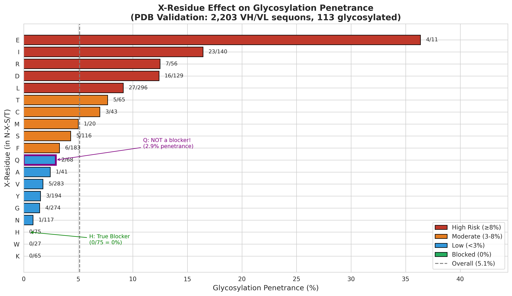
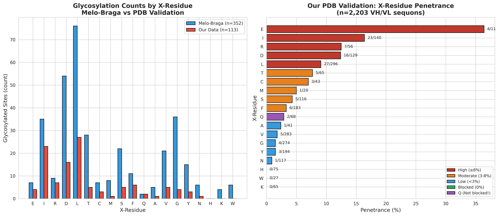
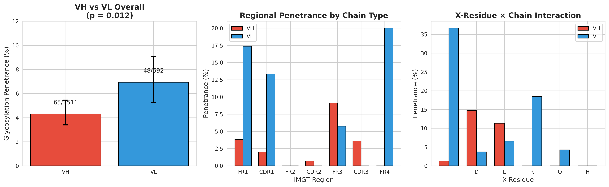
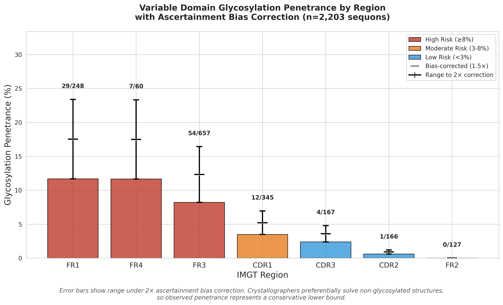

# antibody-glycosylation-penetrance

**Empirically-validated glycosylation penetrance tables for antibody variable domains, with independent refutation of the Melo-Braga H/Q blocker rule.**

[](https://opensource.org/licenses/MIT)

---

## The Problem

ML tools like RFdiffusion generate antibody sequences without considering post-translational modifications. Van de Bovenkamp et al. (2016) showed that 15-25% of circulating IgG carries Fab glycosylation, acquired through somatic hypermutation. When ML tools recapitulate these sequons without the evolutionary selection context, the resulting antibodies may have:

- Heterogeneous glycoform populations
- Altered binding kinetics  
- Reduced stability
- Immunogenicity risk
- Manufacturing variability

**This dataset provides the empirical penetrance values needed to triage ML-designed sequences for glycosylation liability.**

---

## Key Findings

### 1. The H/Q Blocker Rule is Only Half Right

Melo-Braga et al. (2024) claimed both histidine and glutamine at the X-position block glycosylation completely. Our analysis of 19,265 PDB structures shows **Q is not a blocker**:



| X-Residue | Melo-Braga | This Study | Status |
|-----------|------------|------------|--------|
| **H** | 0/6 (0%) | 0/81 (0%) | ✅ Confirmed blocker |
| **Q** | 0/11 (0%) | 2/79 (2.5%) | ❌ **Not a blocker** |
| **I** | Highest | 16.4% | ✅ Confirmed high risk |

---

### 2. Our Dataset is Independent

To ensure this isn't an artifact of re-analyzing Melo-Braga's data, we compared datasets directly:



**Critical:** Both Q glycosylation events occur in our decontaminated dataset (PDBs not in Melo-Braga's study). The penetrance difference (35% vs 5%) reflects opposite ascertainment biases—they sought glycosylated structures, crystallographers avoid them.

---

### 3. VL Chains Have Higher Risk Than VH

A novel finding not reported by Melo-Braga:



| Chain | Sequons | Glycosylated | Penetrance | 
|-------|---------|--------------|------------|
| VH | 1,511 | 65 | 4.3% |
| VL | 692 | 48 | 6.9% |

**Odds ratio: 0.60 (p = 0.012)** — VL has ~60% higher baseline risk than VH.

---

### 4. Regional Hotspots with Bias Correction

Framework regions (especially FR1 and FR4) show highest penetrance. Error bars show sensitivity to ascertainment bias correction:



**Risk hierarchy:** FR1 > FR4 > FR3 >> CDR1 > CDR3 > CDR2 ≈ FR2

---

## Risk Summary

```
BLOCKED (<1%):     H, P
LOW (1-3%):        K, W, N, G, Y, V, Q(VH)
MODERATE (3-10%):  Q(VL), A, F, S, M, C, T, L
HIGH (10-20%):     D, R, I
EXTREME (>20%):    I in FR1 (40%), position 20 (37%)
```

**Third position effect:** N-X-T (10.2%) >> N-X-S (2.3%) — 4.4× higher risk

---

## Quick Start

```python
import pandas as pd

# Load penetrance lookup tables
x_residue = pd.read_csv('data/scanner_x_residue_lookup.csv', index_col=0)
region = pd.read_csv('data/scanner_region_lookup.csv', index_col=0)
chain_x = pd.read_csv('data/scanner_chain_x_lookup.csv', index_col=[0,1])

# Check risk for a sequon with X=Q in VL
risk = chain_x.loc[('VL', 'Q'), 'penetrance']  # Returns 0.043 (4.3%)
```

---

## Repository Contents

```
antibody-glycosylation-penetrance/
├── README.md
├── LICENSE
├── paper/
│   └── intro_methods.md          # Manuscript Introduction & Methods
├── data/
│   ├── PDB_validation_FINAL_dataset.parquet    # Complete sequon dataset
│   ├── scanner_x_residue_lookup.csv            # X-residue penetrance
│   ├── scanner_region_lookup.csv               # Regional penetrance
│   ├── scanner_chain_x_lookup.csv              # Chain × X-residue
│   ├── scanner_position_lookup.csv             # IMGT position-specific
│   └── scanner_third_pos_lookup.csv            # S vs T effect
├── notebooks/
│   └── ALL_Data_penetrance.ipynb               # Full analysis (Colab)
└── figures/
    ├── x_residue_penetrance.png                # Fig 1: X-residue risk
    ├── vh_vl_analysis.png                      # Fig 2: Chain effects
    ├── penetrance_by_region.png                # Fig 3: Regional risk
    └── melo_braga_vs_validation.png            # Fig 4: Dataset comparison
```

---

## Methods Summary

1. **PDB Query:** All human antibody structures (X-ray/cryo-EM, ≤3.5 Å resolution)
2. **Sequon Detection:** N-X-S/T where X ≠ P
3. **Glycosylation Detection:** Carbohydrate residues within 2.0 Å of Asn Nδ
4. **Numbering:** IMGT via ANARCII 2.0.3
5. **Statistics:** Fisher's exact test, Wilson CIs, Bayesian logistic regression (PyMC)

See `paper/intro_methods.md` for full methodology.

---

## Citation

If you use this dataset or findings, please cite:

```bibtex
@misc{antibody_glyco_penetrance_2025,
  author = {[Your Name]},
  title = {Independent Validation of N-linked Glycosylation Penetrance in Antibody Variable Domains},
  year = {2025},
  publisher = {GitHub},
  url = {https://github.com/[username]/antibody-glycosylation-penetrance}
}
```

### Related Work

- Melo-Braga MN et al. (2024) "N-glycosylation in the variable domain of antibodies" — the dataset we validate and extend
- van de Bovenkamp FS et al. (2016) "The emerging importance of IgG Fab glycosylation in immunity" — biological context for SHM-introduced glycosylation

---

## License

MIT License — use freely with attribution.

---

## Contact

Questions or collaboration inquiries: [your email or LinkedIn]
